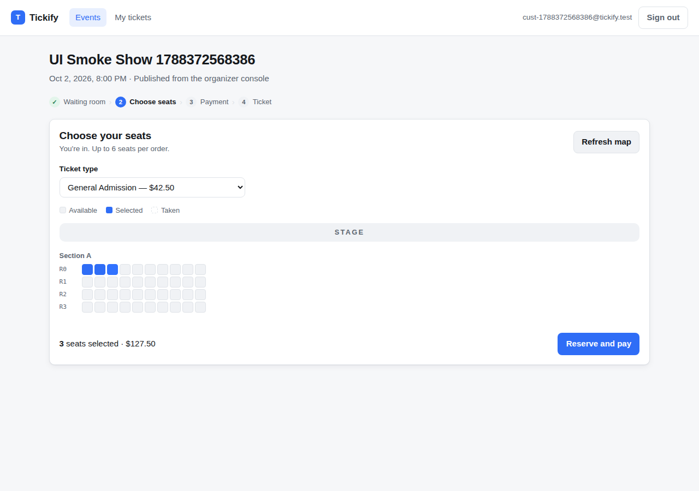
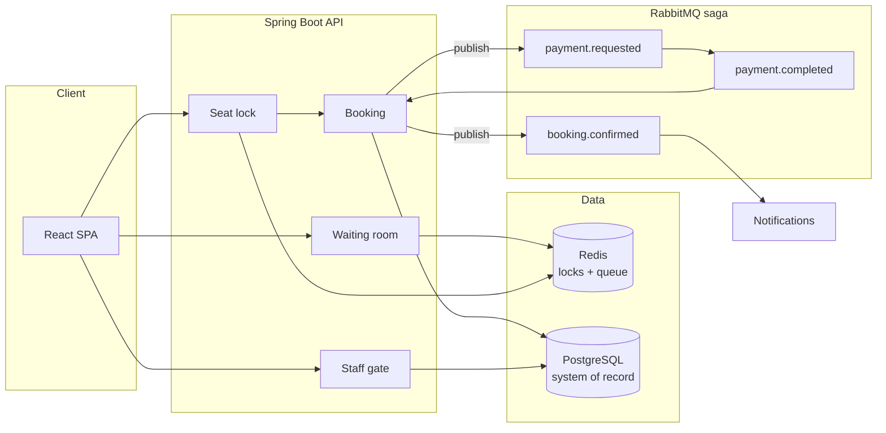
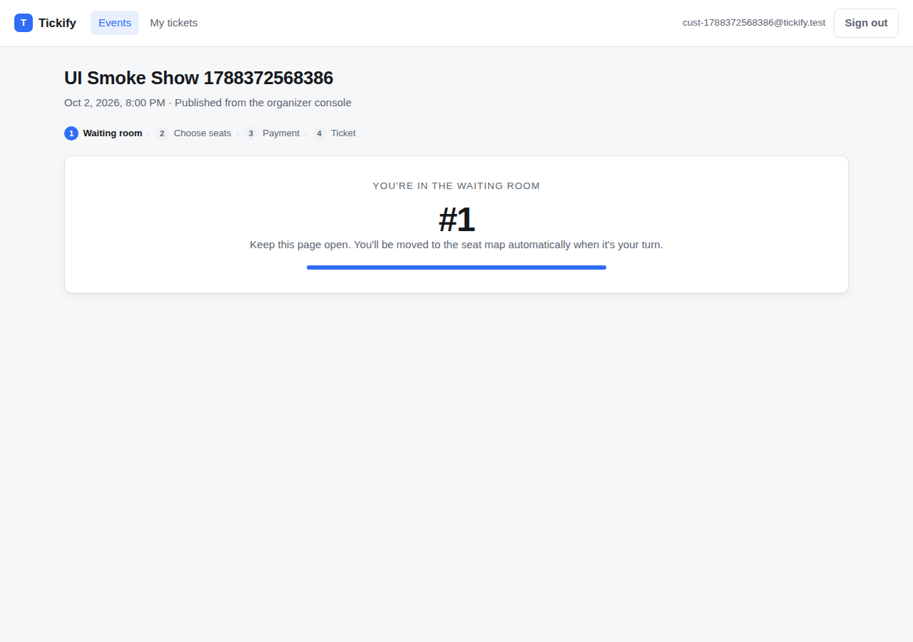
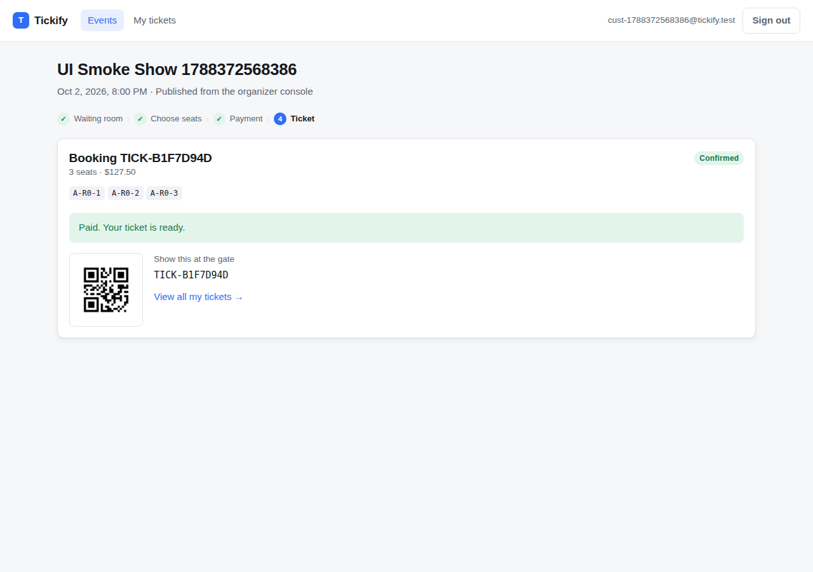
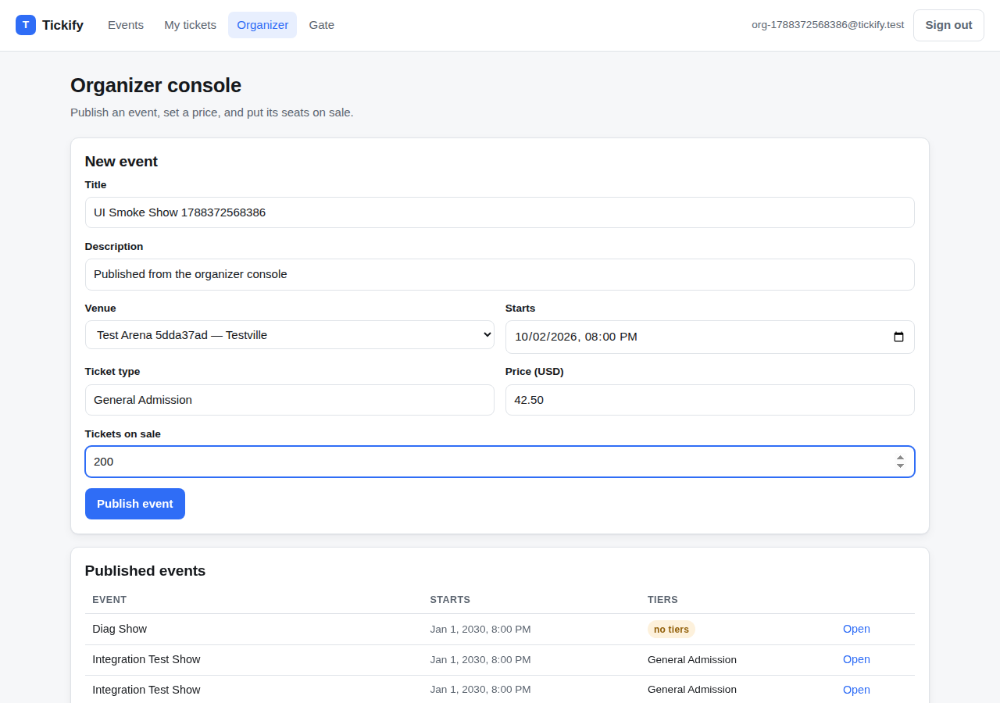
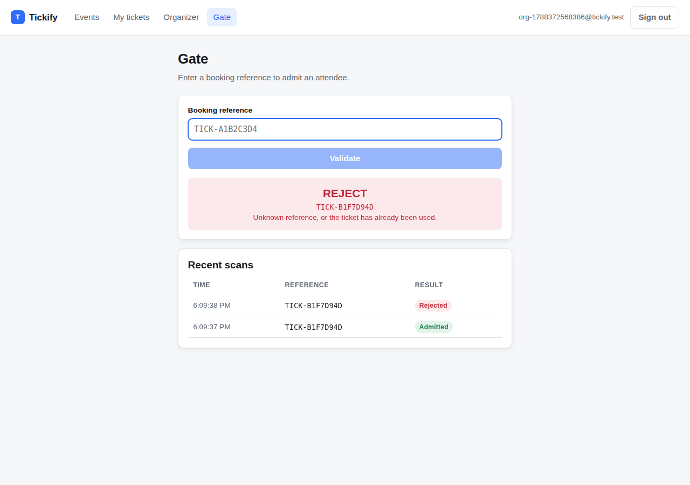
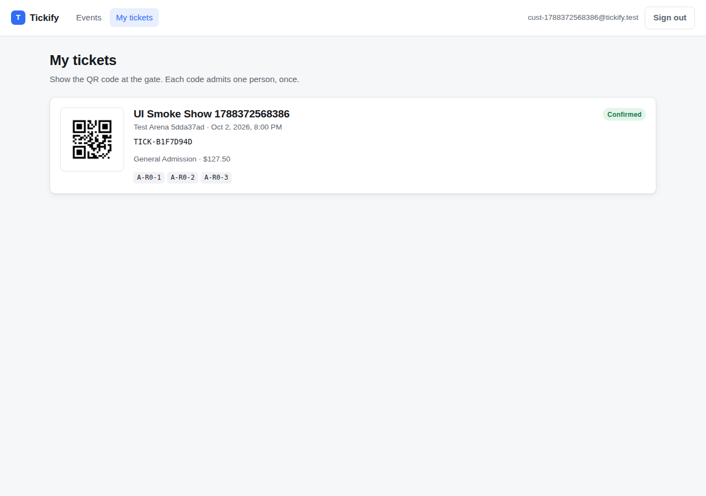

<div align="center">

# Tickify

**A high-concurrency event ticketing platform — virtual waiting room, distributed seat locking, and an event-driven booking saga.**

[](https://openjdk.org/projects/jdk/21/)
[](https://spring.io/projects/spring-boot)
[](https://react.dev)
[](docs/TESTING.md)
[](docs/LOAD_TESTING.md)

</div>

---

Selling 2,000 seats to 50,000 people at 10:00:00 is not a CRUD problem. Everybody wants the
same rows, everybody arrives in the same second, and the one thing you can never do is sell the
same seat twice. Tickify is a working implementation of the machinery that makes that survivable:
a **virtual waiting room** that bounds how much demand reaches the seat map, **Redis seat locks**
that make selection atomic without touching the database, and an **asynchronous payment saga** so
a slow card processor never holds a web thread.

<div align="center">
  
</div>

---

## What it does

| | |
|---|---|
| 🎟 **Virtual waiting room** | Arrivals are parked in a Redis sorted set (FIFO by arrival time) and admitted in fixed batches per second. Load on the booking path is bounded by the promotion rate, not by demand. |
| 🔒 **Distributed seat locks** | `SET NX PX` in Redis. The first request to reach Redis wins the seat; everyone else gets a clean `409`. The database is never asked to arbitrate. Locks carry a TTL, so an abandoned tab releases its seats on its own. |
| 💳 **Event-driven checkout** | `payment.requested → payment.completed → booking.confirmed` over RabbitMQ. Confirmation writes the durable reservation *before* dropping the Redis lock, so a seat is never simultaneously unheld and unsold. |
| 🎫 **QR ticketing** | A ZXing QR code is minted on confirmation and burned at the gate. Single-use, enforced server-side. |
| 👥 **Roles** | `USER`, `ORGANIZER`, `STAFF`, `ADMIN`, enforced with stateless JWTs carrying a `roles` claim. |
| 📈 **Observability** | Correlation-ID tracing, JSON logs, Prometheus metrics for the booking funnel. |
| 🖥 **Web app** | React + TypeScript SPA covering the whole journey: browse → queue → seat map → pay → ticket → gate scan. |

---

## Architecture



The booking path, step by step:

```
1. POST /booking/queue/{event}/join      →  ZADD queue:event:{id}  (FIFO by arrival millis)
2. QueuePromoter, every second           →  admit N users, issue a slot key with a TTL
3. GET  /booking/queue/{event}/status    →  poll until active:true
4. POST /bookings/lock                   →  SET NX per seat, then INSERT a PENDING booking
5. POST /bookings/payment/initiate       →  publish payment.requested, return immediately
6. GET  /bookings/{id}                   →  poll until SUCCESS (QR code) or FAILED (seats released)
```

Full write-up, including the failure modes each mechanism defends against:
**[docs/ARCHITECTURE.md](docs/ARCHITECTURE.md)**

---

## Results

Measured on the reference box described in [docs/LOAD_TESTING.md](docs/LOAD_TESTING.md)
(4 vCPU / 15 GB, with the load generator, app, Postgres, Redis and RabbitMQ all sharing it).

| Scenario | Result |
|---|---|
| **Seat contention** — 150 buyers, one seat, simultaneously | **exactly 1 winner, 149 clean `409`s, 0 unexpected statuses** |
| **Ticket drop** — 200 concurrent shoppers, 75s | **1,353 req/s · 101,514 requests · 0 failures** · seat-lock p95 **258 ms** |
| **Browse baseline** — 100 concurrent shoppers | **568 req/s** · events-list p95 **17 ms** · 0 failures |

The load tests also found three real bugs, which is rather the point of having them:

- an **N+1 query** on the events list — p95 `575 ms → 107 ms` back-to-back once fixed;
- a **declined payment left its `booking_seats` row behind**, so the seat went back on sale in
  Redis but could never be sold again (every later buyer hit a unique-constraint 500);
- the load generator's own **bcrypt sign-ups were consuming most of the CPU**, so the first runs
  were measuring registration rather than booking — 214 req/s vs 1,353 req/s once separated.

Numbers, methodology and the full before/after: **[docs/LOAD_TESTING.md](docs/LOAD_TESTING.md)**

---

## Quick start

**With Docker** (starts Postgres, Redis, RabbitMQ and MailHog from `compose.yaml`):

```bash
./mvnw spring-boot:run          # compose comes up automatically
```

**Without Docker** — native services, the way the load-test results above were produced:

```bash
./scripts/dev-stack.sh start    # postgres:5432 redis:6379 rabbitmq:5672 smtp:1025
./mvnw -DskipTests -Pfrontend package
./scripts/run-app.sh start
```

Then open:

| | |
|---|---|
| Web app | <http://localhost:8080> |
| API docs (Swagger UI) | <http://localhost:8080/swagger-ui.html> |
| Health | <http://localhost:8080/actuator/health> |
| Metrics | <http://localhost:8080/actuator/prometheus> |

Sign up from the UI and tick **ORGANIZER** and **STAFF** as well as **USER** — that gives you the
organizer console (to publish an event) and the gate scanner (to validate the ticket you buy).

### Frontend in development

The SPA can also run on its own with hot reload, proxying the API:

```bash
cd frontend && npm install && npm run dev     # http://localhost:5173
```

`./mvnw -Pfrontend package` builds it and bundles it into the jar, so
`java -jar target/tickify-1.0.0.jar` serves the API and the UI from one artifact.

---

## The web app

| Waiting room | Seat map | Ticket |
|---|---|---|
|  |  |  |

| Organizer console | Gate scanner | My tickets |
|---|---|---|
|  |  |  |

---

## Tests

```bash
./mvnw test                                              # 68 unit + web-slice tests, no infrastructure
./mvnw verify -Pintegration-tests                        # + 10 end-to-end tests via Testcontainers
./mvnw verify -Pintegration-tests -Dtickify.it.external=true   # ...or against a running stack
```

The suite is built around the properties that actually matter here — that a seat cannot be sold
twice, that a redelivered message cannot mint a second ticket, that a QR code cannot admit two
people, and that `@PreAuthorize` is genuinely enforced. **[docs/TESTING.md](docs/TESTING.md)**

## Load tests

```bash
./loadtest/run.sh               # seeds an event, runs all three k6 scenarios
```

**[docs/LOAD_TESTING.md](docs/LOAD_TESTING.md)**

---

## Tech stack

**Backend** — Java 21 (virtual threads), Spring Boot 3.5, Spring Security (OAuth2 resource server,
RSA-signed JWTs), Spring Data JPA, Flyway, PostgreSQL 16, Redis 7, RabbitMQ 3, ZXing, springdoc-openapi.

**Frontend** — React 18, TypeScript 5, Vite 5, React Router. No UI framework: the seat map needs
direct control over a grid of thousands of cells.

**Quality** — JUnit 5, Mockito, AssertJ, Awaitility, Testcontainers, JaCoCo, k6.

---

## Documentation

| | |
|---|---|
| [Architecture](docs/ARCHITECTURE.md) | How the waiting room, seat locks and saga fit together, and what each defends against |
| [API reference](docs/API.md) | Every endpoint, with the booking flow end to end |
| [Testing](docs/TESTING.md) | Test strategy, the layers, and how to run them |
| [Observability](docs/OBSERVABILITY.md) | Correlation IDs, structured logs, metrics |
| [Load testing](docs/LOAD_TESTING.md) | Scenarios, methodology, results, and the bugs they found |
| [Engineering notes](docs/ENGINEERING_NOTES.md) | Design decisions, trade-offs, and what I would do next |

## Licence

MIT
